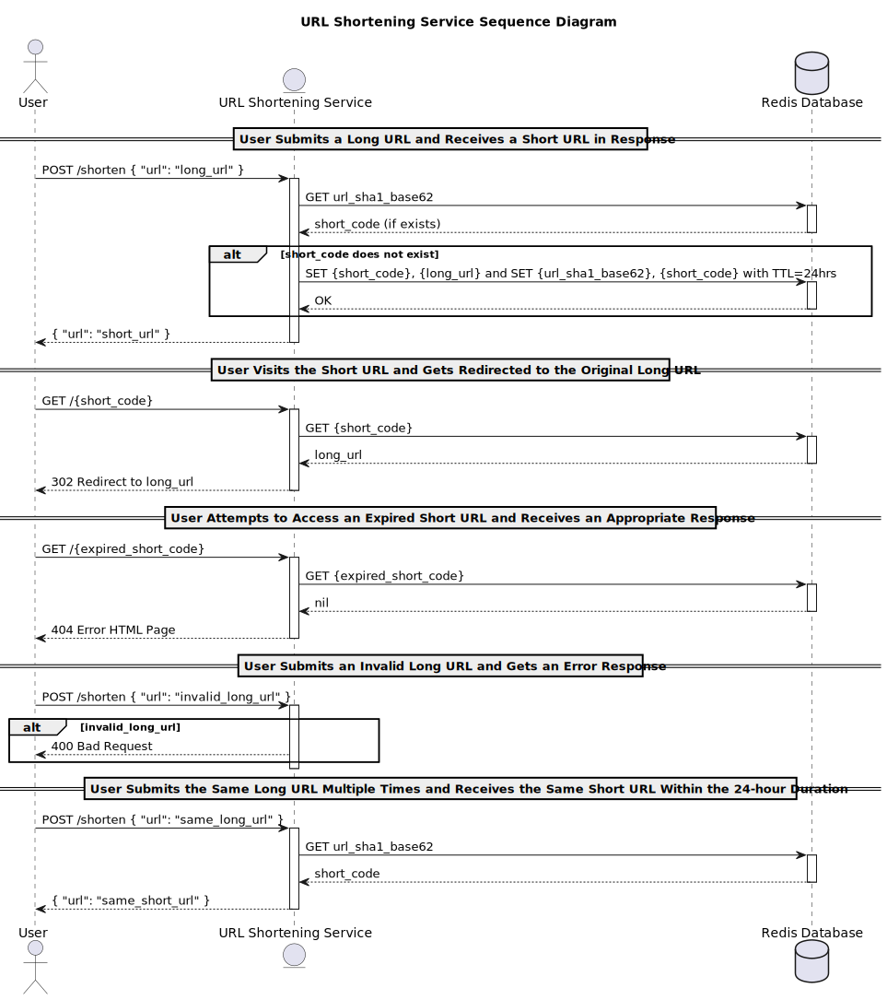

# AI Code Example - URL Shortening Service - "Shorty"

The code in this repository was generated with the help of AI.

It serves as a practical example for pairing with AI to generate code.

The details about how this was generated can be read at
[devdetails.com](https://blog.devdetails.com/publish/post/127680806).

- [Part 1](https://blog.devdetails.com/p/a-practical-example-of-using-ai-for): Setup and Process
- [Part 2](https://blog.devdetails.com/p/designing-software-with-ai): Design
- [Part 3](https://blog.devdetails.com/p/diagrams-and-api-design-with-ai): Sequence diagram and API specification
- [Part 4](https://blog.devdetails.com/p/generating-tests-with-ai): Generating tests
- [Part 5](https://blog.devdetails.com/p/generating-application-code-from): Generating the application and making it work


The code is a solution to
[Write Your Own URL Shortener](https://codingchallenges.fyi/challenges/challenge-url-shortener/)
by [Coding Challenges](https://codingchallenges.fyi).

---

- [Prompt 1: Design](prompt1_design.md)
    - [Design Document](design.md)
- [Prompt 2: PlantUML](prompt2_plantuml.md)
    - [PlantUML](design.puml)
- [Prompt 3: OpenAPI](prompt3_openapi.md)
    - [Open API Specification](openapi.yaml)

---



---

Here's what ChatGPT has to say about the process. Everything past this point
was generated by it.

## Introduction

"Shorty" is a URL shortening service created through an iterative and
collaborative process between the development team and an advanced AI language
model from OpenAI, GPT-4.

Our goal was to design and implement a robust URL shortening service, capable of
generating and storing a significant number of short URLs daily, all while being
efficient in terms of memory usage and response time. The service was built with
a focus on scalability, to handle potential increases in demand.

## Project Journey

We started the project with the design phase. It was here where we set the
requirements and specifications of the application. From the functional and
non-functional requirements to the technical details, we were able to clearly
define what we needed the application to achieve. We chose to use Python, with
the Connexion library for API service and Redis as our backend storage.

Once we had a solid design, we started working on the technical aspects of the
project. We used OpenAPI to specify the application's API, which we designed to
be intuitive and user-friendly. The API specification allowed us to outline how
the application would behave, from processing requests to handling errors.

In parallel, we collaborated on the development of a sequence diagram that
mapped the key interactions within the application. The diagram visualized how
data flowed within the system, and helped identify areas that might require
special attention during the implementation phase.

Next, we moved onto implementing the API endpoints and defining the core
functionalities. We prioritized clear, readable, and efficient code, adhering to
PEP8 standards for naming conventions and using Python's `black` for code
formatting. Throughout the process, GPT-4 provided support and feedback, helping
to streamline the development and maintain high coding standards.

With the implementation underway, we then turned our attention to testing.
Following a test-driven development (TDD) approach, we outlined tests for each
of the use cases we'd identified in the design phase. We used pytest as our
testing framework and fakeredis to mimic our Redis storage during testing. Each
use case had its own set of tests, ensuring that all parts of the application
were thoroughly validated.

## Conclusion

Working with GPT-4 was an illuminating experience. The AI model was instrumental
in refining our initial design, assisting in writing our API specifications,
guiding us during the implementation phase, and helping us craft thorough and
effective tests. Its ability to understand and respond to complex technical
problems, provide suggestions, and learn from our feedback proved to be
invaluable throughout the project.

We believe "Shorty" is a high-performing and reliable URL shortening service,
and the process of its creation demonstrated the potential of leveraging AI in
the field of software development. We hope this project serves as a blueprint
for how AI and human collaboration can achieve remarkable results.

## Running the project

If you're new to Python, I recommend using ChatGPT to walk you through
the setup. You can paste it this part of the README and ask for a walk
through.

To run, you'll need 
[Python 3.10, 3.11, or 3.12 installed](https://docs.python-guide.org/starting/installation/).

This project utilizes [Poetry](https://python-poetry.org/), a tool for dependency 
management and packaging in Python. Poetry simplifies dependency management, 
ensuring that you have the right versions of libraries needed and making it 
easy to manage those dependencies. Follow the instructions 
[here](https://python-poetry.org/docs/#installation) 
for installation.

### Setting up the Environment

After installing Poetry, clone the project repository and navigate to the 
project directory. Install all necessary dependencies with the 
following command:

```bash
poetry install --no-root
```

The next step is to make sure everything is installed properly by running
the tests.

### Running Tests

Testing is a core aspect of this project. 

To run the tests, execute the following command:

```bash
poetry run pytest
```

This command will run all tests using `pytest`, 
a powerful testing framework for Python.

### Running the Project

As this project is an experiment primarily focused on testing, there isn't
a main application to run. However, if you wish to execute the core script,
you can run it.

Before running `shorty.py`, you need to configure Redis as per your 
setup. This script requires a working Redis instance to function properly.

Run with:

```bash
poetry run python shorty.py
```

### Understanding `openapi.yaml` and Connexion

This project makes use of `openapi.yaml`, which is a specification file used
by [Connexion]((https://connexion.readthedocs.io/)). Connexion is a framework 
on top of Flask that automagically handles HTTP requests defined using 
[OpenAPI](https://www.openapis.org/). 

The `openapi.yaml` file outlines the API's design and routes, which 
Connexion uses to route incoming requests to the Python functions that 
should handle them.

### Additional Information on Dependencies

- [connexion](https://connexion.readthedocs.io/): Used for handling HTTP 
  requests in Python applications.
- [redis](https://redis-py.readthedocs.io/): This is a Python 
  client for Redis, a key-value store.
- [pytest](https://docs.pytest.org/): A framework for writing 
  and running tests in Python.
- [freezegun](https://github.com/spulec/freezegun): A library that allows
  your Python tests to travel through time by mocking the datetime module.
- [fakeredis](https://fakeredis.readthedocs.io/): A fake Redis
  server implementation for testing purposes.
